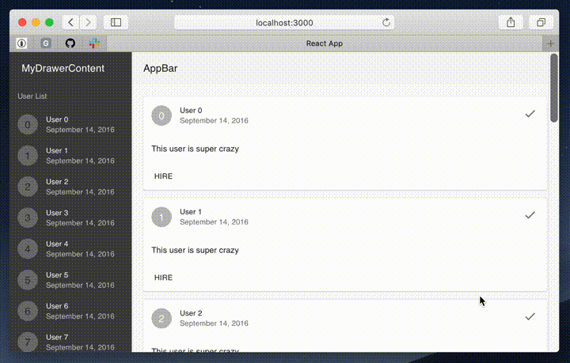

This project was bootstrapped with [Create React App](https://github.com/facebook/create-react-app).

## Material UI responsive convination of AppBar and Drawer

In this demo, I try to implement `AppBar`
varying its background into lite color
when the drawer docks on the page side,
to avoid that the content has heavy impression.

